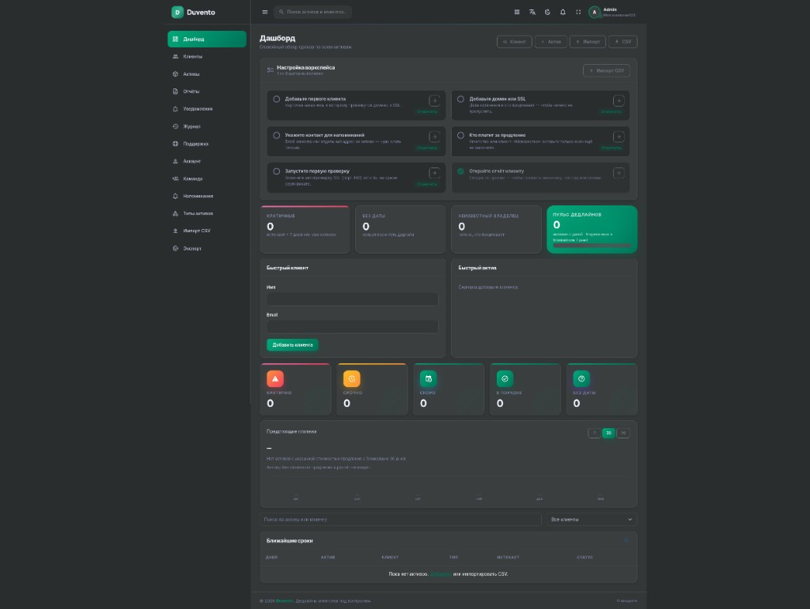
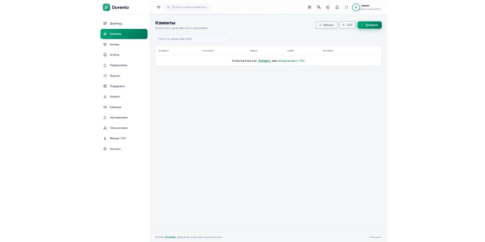
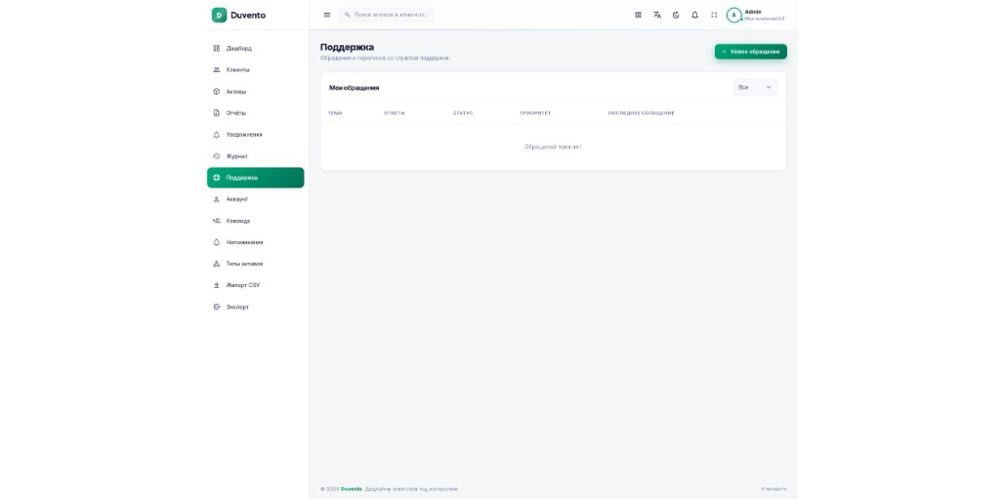

# Duvento

[English](README.md) · [Українська](README.uk.md) · [Русский](README.ru.md)

**Спокойный контроль дедлайнов для веб-агентств.** Домены, SSL-сертификаты, хостинг, лицензии плагинов и другие продления — в одном месте.

Duvento — бесплатная self-hosted система под лицензией AGPL-3.0-or-later. Docker необязателен.

## Возможности

- Цветовые статусы продлений Critical / Urgent / Soon / OK
- Автоматическая проверка срока действия SSL без платного стороннего API
- Email-напоминания с настраиваемыми интервалами
- Сумма предстоящих платежей на 7, 30 и 90 дней
- Клиенты, собственные типы активов, журнал действий и импорт/экспорт CSV
- Публичные read-only ссылки со статусом для клиентов
- Приглашения команды, встроенные обращения в поддержку, поиск и уведомления
- Интерфейс на английском, украинском, русском, немецком, испанском и польском

## Скриншоты

### Дашборд



### Клиенты



### Поддержка



## Требования

- PHP 8.3+ с `pdo_mysql` или `pdo_sqlite`, `mbstring`, `openssl`, `tokenizer`, `xml`, `ctype`, `json` и `intl`
- MySQL/MariaDB для production; SQLite подходит для ознакомления
- Веб-сервер с корнем сайта, направленным на `public/`
- Одно cron-задание для проверок SSL, напоминаний и почтовой очереди

Composer 2 и Node.js 20+ нужны только при установке из исходного кода. В release-архиве зависимости и статика уже собраны.

## Рекомендуется: архив и веб-инсталлятор

1. Скачайте **[duvento.zip](https://github.com/accusser/duvento/releases/latest/download/duvento.zip)** из [последнего релиза](https://github.com/accusser/duvento/releases/latest).
2. Распакуйте архив в каталог сайта.
3. Направьте корень сайта nginx или Apache на каталог `public/`.
4. Дайте PHP-пользователю права записи в корень проекта (для создания `.env`), `storage/` и `bootstrap/cache/`.
5. Откройте сайт — Duvento перенаправит вас на `/install`.
6. Пройдите мастер: язык → проверка сервера → база данных → миграции → администратор.
7. Сохраните сгенерированный адрес админки и добавьте cron с последнего экрана.

В архиве уже находятся PHP-зависимости и собранная статика, поэтому Composer, Node.js и Artisan на сервере не нужны.

Инсталлятор создаёт чистую production-систему без демонстрационных записей. После установки `/install` возвращает 404 и не может сбросить существующую систему.

## Установка из исходного кода

```bash
git clone https://github.com/accusser/duvento.git
cd duvento
composer install --no-dev --optimize-autoloader
npm install
npm run build
cp .env.example .env
php artisan key:generate
```

Настройте `DB_*` и `APP_URL` в `.env`; для SQLite создайте `database/database.sqlite`. Затем выполните:

```bash
php artisan migrate --force
php artisan duvento:install
```

Команда безопасно запросит пароль, создаст владельца первого рабочего пространства и администратора и сгенерирует приватный `ADMIN_PATH`. Не запускайте сидеры в production.

Для локальной разработки используйте `composer run setup`.

## Настройка production

Добавьте планировщик в crontab пользователя веб-сервера:

```cron
* * * * * cd /var/www/duvento && php artisan schedule:run >> /dev/null 2>&1
```

Настройте SMTP в `.env`: `MAIL_MAILER=smtp`, `MAIL_HOST`, `MAIL_PORT`, `MAIL_USERNAME`, `MAIL_PASSWORD` и `MAIL_FROM_ADDRESS`. Почта нужна для напоминаний и восстановления пароля. `MAIL_MAILER=log` используйте только для тестирования.

Стандартную очередь в базе обрабатывает планировщик; постоянный queue worker не нужен.

Пример конфигурации nginx:

```nginx
server {
    listen 80;
    server_name duvento.example;
    root /var/www/duvento/public;
    index index.php;

    location / {
        try_files $uri $uri/ /index.php?$query_string;
    }

    location ~ \.php$ {
        include fastcgi_params;
        fastcgi_pass unix:/run/php/php-fpm.sock;
        fastcgi_param SCRIPT_FILENAME $realpath_root$fastcgi_script_name;
    }
}
```

В production используйте HTTPS, храните `.env` вне публичного корня и делайте резервные копии базы данных и `storage/app/`.

## Обновление

Перед обновлением сделайте резервные копии базы данных, `.env` и `storage/app/`. Замените файлы приложения, сохранив эти данные, затем выполните:

```bash
php artisan migrate --force
php artisan optimize:clear
```

## Docker (необязательно)

```bash
cp .env.example .env
# Установите DB_CONNECTION=mysql и DB_HOST=db в .env
docker compose up -d --build
```

Приложение доступно на `http://127.0.0.1:8090`; запланированные задачи выполняет сервис `scheduler`.

## Self-host и Cloud

Этот репозиторий содержит бесплатную self-host редакцию. Управляемая Duvento Cloud использует то же ядро, а также включает hosted billing, white-label отчёты, публичный API/webhooks и приоритетную поддержку. Закрытые cloud-модули не входят в этот AGPL-репозиторий.

## Лицензия

[AGPL-3.0-or-later](LICENSE)
